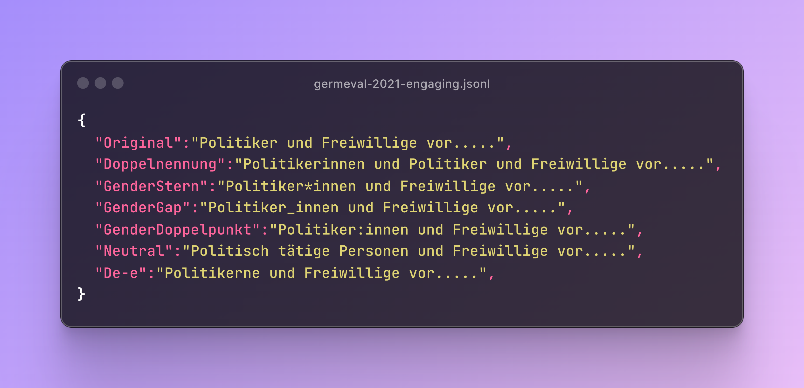

# The `Lou` Dataset - Exploring the Impact of Gender-Fair Language in German Text Classification


*Figure 1, example entry of the `Lou` dataset with the `original` instance of the engaging detection task from the GermEval-2021 dataset and its six reformulations.*

This work explores the impact of gender-fair language for German text classification tasks. 
We provide in this repository:
* The `Lou` dataset including the gender-inclusive and gender-neutral reformulations according to six gender-fair strategies.
* Source code to run the experiments reported in our work.

If there are any issues or questions, we are happy to help you. Just open an issue or e-mail us. 


> **Abstract:** Gender-fair language, an evolving linguistic variation in German, fosters inclusion by addressing all genders or using neutral forms. However, there is a notable lack of resources to assess the impact of this language shift on language models (LMs) might not been trained on examples of this variation. Addressing this gap, we present Lou, the first dataset providing high-quality reformulations for German text classification covering seven tasks, like stance detection and toxicity classification. We evaluate 16 mono- and multi-lingual LMs and find substantial label flips, reduced prediction certainty, and significantly altered attention patterns. However, existing evaluations remain valid, as LM rankings are consistent across original and reformulated instances. Our study provides initial insights into the impact of gender-fair language on classification for German. However, these findings are likely transferable to other languages, as we found consistent patterns in multi-lingual and English LMs.
> 
Contact person: Andreas Waldis, andreas.waldis@live.com

https://www.ukp.tu-darmstadt.de/

https://www.tu-darmstadt.de/


> This repository contains experimental software and is published for the sole purpose of giving additional background details on the respective publication.


## The Lou Dataset

The `Lou` dataset provides gender-fair reformulation of instances from seven German classification task.

### Tasks and Data
We include seven tasks (*sentiment analysis* and *stance-*, *fact-claiming-*, *engaging-*, *hate-speech-*, and *toxicity-detection*) from the [X-Stance](https://huggingface.co/datasets/ZurichNLP/x_stance), [GermEval-2021](https://germeval2021toxic.github.io/SharedTask/), and [DeTox](https://github.com/hdaSprachtechnologie/detox) datasets.
For `Lou`, you need access to the full version of DeTox.
Therefore, we excluded it from this public repository. 
However, we are happy to this part of `Lou` with you when you provide us the approval which you can request [here](https://github.com/hdaSprachtechnologie/detox)

### Reformulation Strategies
With `Lou`, we follow six strategies to reformulate a text with a masculine formulation (like *Politiker*) gender-fair. *Figure 1* shows one example.
* **Binary Gender Inclusion** (`Doppelnennung`) explicitly mentions the feminine and masculine but ignores others like agender.
For example, *Politiker* (politician.MASC.PL) is transformed into *Politikerinnen und Politiker* (*politician.FEM.PL and politician.MASC.PL*).
* **All Gender Inclusion** explicitly addresses every gender, including agender, non-binary, or demi-gender, using a gender gap character pronounced with a small pause.
We consider three commonly used strategies with different gender characters: `GenderStern` (*), `GenderDoppelpunkt` (:), and  `GenderGap` (_).
For example, *Politiker* (politician.MASC.PL) is turned into *Politiker*innen*, *Politiker:innen*, or *Politiker_innen* (*politician.FEM.MASC.NEUT.PL*).
* **Gender Neutralization** avoids naming a particular gender. For this strategy (`Neutral`), we use neutral terms like *ärztliche Fachperson* (*medical professional*).
* **Neosystem** (`De-e`) is a well-specified system that emerged from a significant [community-driven effort](https://geschlechtsneutral.net).
This strategy use a fourth gender, including new pronouns, articles, and suffixes to avoid naming a particular gender.
For example, *Politiker* (*politician.MASC.PL*) is changed to *Politikerne* (*politician.FEM.MASC.NEUT.PL*).


## Experiments
With the following steps, you can run the experiments of the paper on the `Lou` dataset.

### Setup
This repository requires Python3.7 or higher; further requirements can be found in the requirements.txt.
Install them with the following command:

```
$ python3 -m venv venv
$ source venv/bin/activate
$ pip install -r requirements.txt
```

Next, you need to setup the `.env`.
Either copy `.env_dev` (development) or `.env_prod` (production) to `.env` and set your OpenAI (`OPENAI_KEY`) key, if you would like to run the in-context learning (ICL) experiments with OpenAI models.

```
$ cp .env_dev .env #development
$ cp .env_prod .env #production
```

Finally, you need to log in with your wandb account for performance reporting.

```
$ wandb login
```


### Tasks

This work relies on the following different datasets:
*  Stance Detection (`x-stance-de`)
*  Fact-Claiming Detection (`germeval-factclaiming`)
*  Engaging Detection (`germeval-engaging`)
*  Toxicity Detection (`germeval-toxic` and `detox-toxic`)
*  Hate-Speech Detection (`detox-hate_speech`)
*  Sentiment Analysis (`detox-sentiment`)

The tasks file to run the experiments are placed in the `tasks` folder. 
* `train.jsonl` includes the original training instances without any reformulation.
* `dev.jsonl` includes the original development instances without any reformulation.
* `test_original.jsonl` includes the original test instances with masculine formulations.
* `test_{STRATEGY}.jsonl` includes the reformulated test instances following a specific strategy. 

When you get access to the full version of DeTox, we provide you the corresponding files. 
You can put them in the `tasks` folder.

### Fine-Tuning Experiments
