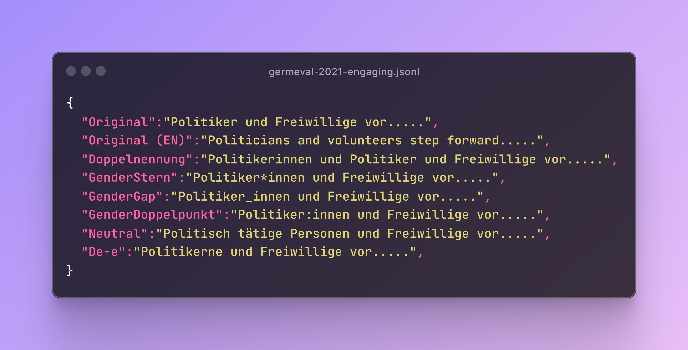

# The `Lou` Dataset - Exploring the Impact of Gender-Fair Language in German Text Classification


*Figure 1, example entry of the `Lou` dataset with the `original` instance of the engaging detection task from the GermEval-2021 dataset and its six reformulations.*

This work explores the impact of gender-fair language on German text classification tasks.
We provide in this repository:
* The `Lou` dataset includes gender-inclusive and gender-neutral reformulations using six gender-fair strategies.
* Source code to run the experiments reported in our work.

We are happy to help you with any issues or questions. Just open an issue or e-mail us.


<details>
<summary>
<strong>Open for the abstract.</strong>
</summary>

> Gender-fair language, an evolving linguistic variation in German, fosters inclusion by addressing all genders or using neutral forms. However, there is a notable lack of resources to assess the impact of this language shift on language models (LMs) might not been trained on examples of this variation. Addressing this gap, we present Lou, the first dataset providing high-quality reformulations for German text classification covering seven tasks, like stance detection and toxicity classification. We evaluate 16 mono- and multi-lingual LMs and find substantial label flips, reduced prediction certainty, and significantly altered attention patterns. However, existing evaluations remain valid, as LM rankings are consistent across original and reformulated instances. Our study provides initial insights into the impact of gender-fair language on classification for German. However, these findings are likely transferable to other languages, as we found consistent patterns in multi-lingual and English LMs.
</details>
Contact person: Andreas Waldis, andreas.waldis@live.com

https://www.ukp.tu-darmstadt.de/

https://www.tu-darmstadt.de/


> This repository contains experimental software and is published to give additional background details on the respective publication.


## The Lou Dataset

The `Lou` dataset provides gender-fair reformulations for instances from seven German classification tasks.
It is intended for non-commercial use and research is licensed under the CC BY-NC 4.0 licence.
The copyright of the original text remains at the original datasets.

### Tasks and Data
We include seven tasks (*sentiment analysis* and *stance-*, *fact-claiming-*, *engaging-*, *hate-speech-*, and *toxicity-detection*) from the [X-Stance](https://huggingface.co/datasets/ZurichNLP/x_stance), [GermEval-2021](https://germeval2021toxic.github.io/SharedTask/), and [DeTox](https://github.com/hdaSprachtechnologie/detox) datasets.
For `Lou`, you need access to the full version of DeTox.
Therefore, we excluded it from this public repository.
However, we are happy to share this part of `Lou` with you when you provide us the approval, which you can request [here](https://github.com/hdaSprachtechnologie/detox)

### Reformulation Strategies
With `Lou`, we provide gender-inclusive and gender-neutral reformulations for masculine formulations, like *Politiker* in *Figure 1*.
We use six strategies: `Doppelnennung`, `GenderStern`, `GenderDoppelpunkt`, `GenderGap`, `Neutral`, and `De-e`.

<details>
<summary>
<strong>Open for more details about these reformulation strategies.</strong>
</summary>

* **Binary Gender Inclusion** (`Doppelnennung`) explicitly mentions the feminine and masculine but ignores others like agender.
  For example, *Politiker* (politician.MASC.PL) is transformed into *Politikerinnen und Politiker* (*politician.FEM.PL and politician.MASC.PL*).
* **All Gender Inclusion** explicitly addresses every gender, including agender, non-binary, or demi-gender, using a gender gap character pronounced with a small pause.
  We consider three commonly used strategies with different gender characters: `GenderStern` (\*), `GenderDoppelpunkt` (:), and  `GenderGap` (_).
  For example, *Politiker* (politician.MASC.PL) is turned into *Politiker*innen*, *Politiker:innen*, or *Politiker_innen* (*politician.FEM.MASC.NEUT.PL*).
* **Gender Neutralization** avoids naming a particular gender. For this strategy (`Neutral`), we use neutral terms like *ärztliche Fachperson* (*medical professional*).
* **Neosystem** (`De-e`) is a well-specified system that emerged from a significant [community-driven effort](https://geschlechtsneutral.net).
  This strategy uses a fourth gender, including new pronouns, articles, and suffixes to avoid naming a particular gender.
  For example, *Politiker* (*politician.MASC.PL*) is changed to *Politikerne* (*politician.FEM.MASC.NEUT.PL*).
</details>

### Files
You find in the `lou` folder one file for each task, for example, `germeval-engaging.jsonl`.
These files contain one json-entry for each instance. 
As shown in *Figure*, such an instance-entry includes the original (`Original`) text along with the reformulated version regarding the six gender-inclusive and gender-neutral strategies. 
In addition, you find the task specific annotation (`label`), and for the stance detection task (`x-stance-de`) the corresponding topic.

## Experiments
With the following steps, you can run the experiments of the paper on the `Lou` dataset.

### Setup
This repository requires Python3.7 or higher; further requirements can be found in the requirements.txt.
Install them with the following command:

```
$ python3 -m venv venv
$ source venv/bin/activate
$ pip install -r requirements.txt
```

Next, you need to setup the `.env`.
Either copy `.env_dev` (development) or `.env_prod` (production) to `.env` and set your OpenAI (`OPENAI_KEY`) key, if you would like to run the in-context learning (ICL) experiments with OpenAI models.

```
$ cp .env_dev .env #development
$ cp .env_prod .env #production
```

Finally, you must log in with your wandb account for performance reporting.

```
$ wandb login
```


### Tasks

This work relies on the following seven tasks:
*  Stance Detection (`x-stance-de`)
*  Fact-Claiming Detection (`germeval-factclaiming`)
*  Engaging Detection (`germeval-engaging`)
*  Toxicity Detection (`germeval-toxic` and `detox-toxic`)
*  Hate-Speech Detection (`detox-hate_speech`)
*  Sentiment Analysis (`detox-sentiment`)

You find one sub-folder for each task in the `tasks` folder, like `tasks/x-stance-de`.
This sub-folder contains the splits for training, development, and testing.
Along with the `Lou` part of DeTox, we provide the corresponding split files to run experiments, which you can just put into the corresponding sub-folder, like `tasks/detox-sentiment`.

<details>
<summary>
<strong>Open for more details about these split files.</strong>
</summary>

* `train.jsonl` includes the original training instances without any reformulation.
* `dev.jsonl` includes the original development instances without any reformulation.
* `test_original.jsonl` includes the original test instances with masculine formulations.
* `test_{STRATEGY}.jsonl` includes the reformulated test instances following a specific strategy.

</details>


### Performance Reporting

This repository uses *wandb* for performance logging and saving predictions.
Further, we use this service to check whether we can skip a run since it was done or not based on the parameters.
If so, you will see the feedback `Run already done`.

### Fine-Tuning Experiments
We provide code to run the hyperparameter search and the full fine-tuning experiments.

#### Hyperparameter Search


Using `run_fine_tuning_tasks_hyperparams.py` you can run a hyperparameter search (`batch_size` and `learning_rate`) for a language model (`--model_name`) for a set of tasks.
This file will report results for the hyperparameter search to *wandb*, where you can select the best one.
<details>
<summary>
<strong>List of optional parameters.</strong>
</summary>

* `--tasks`, a specific set of tasks otherwise, all tasks are considered, for example, `x-stance-de,germeval-engaging`
* `--seeds`, a list of seeds to evaluate every hyperparameter pair (`batch_size` and `learning_rate`), default `0,1,2`
* `--batch_sizes`, a list of batch sizes to evaluate, default `8,16,32`
* `--learning_rates`, a list of learning rates to evaluate, default `0.00005,0.00002,0.00001`
</details>

After running these experiments, you need to add a new entry with the resulting hyperparameters for every task and model to the file `hyperparams.py`.

```json
"x-stance-de":{
    "deepset/gbert-base": {
        "batch_size": 32,
        "learning_rate": 5e-05
    }, 
}
```


#### Full Fine-Tuning Experiments


Using `run_fine_tuning_tasks.py`, you can run the complete fine-tuning experiments for a language model (`--model_name`) for a set of tasks.
All results will be reported to *want*.
<details>
<summary>
<strong>List of optional parameters.</strong>
</summary>

* `--tasks`, a specific set of tasks otherwise, all tasks are considered, for example `x-stance-de,germeval-engaging`
* `--seeds`, a list of seeds to evaluate every hyperparameter pair (`batch_size` and `learning_rate`), default `0,1,2,3,4,5,6,7,8,9`
</details>

### In-Context Learning Experiments


For the ICL experiments, you can use OpenAI models or any library replicating an OpenAI endpoint, like [vLLM](https://github.com/vllm-project/vllm).

<details>
<summary>
<strong>Open for an example of running a Huggingface with vLLM.</strong>
</summary>

```bash
docker run --gpus \"device=0\" \
    -v /home/cache/vllm-cache:/root/.cache/huggingface \
    --env "HUGGING_FACE_HUB_TOKEN=<secret>" \
    -p 9876:9876 \
    --ipc=host \
    vllm/vllm-openai:latest \
    --model mayflowergmbh/Llama-3-SauerkrautLM-8b-Instruct-AWQ \
    --served-model-name mayflowergmbh/Llama-3-SauerkrautLM-8b-Instruct-AWQ \
    --quantization awq \
    --gpu-memory-utilization 0.7 \
    --port 9876
```
</details>

Using `run_icl_tasks.py`, you can run the complete in-context learning experiments for a language model (`--model_name`) for a set of tasks.
You need to specify another API endpoint, other than the original OpenAI one, for example, with `--endpoint https://10.10.10.1.9876/v1`
<details>
<summary>
<strong>List of optional parameters.</strong>
</summary>

* `--tasks`, a specific set of tasks otherwise, all tasks are considered, for example, `x-stance-de,germeval-engaging`
* `--ks`, a list of number of few-shot examples to evaluate, 0=zero-shot, 1=one-shot, 2=two-shot, and so on, default `0,1,2,3,4,5,6,7,8,9`
* `--seeds`, a list of seeds to run for few-shot setting, default `0,1,2,3,4,5,6,7,8,9`
* `--template_indices`, a list of prompting template to evaluate, default `0,1,2,3`
</details>

### Citation
Todo